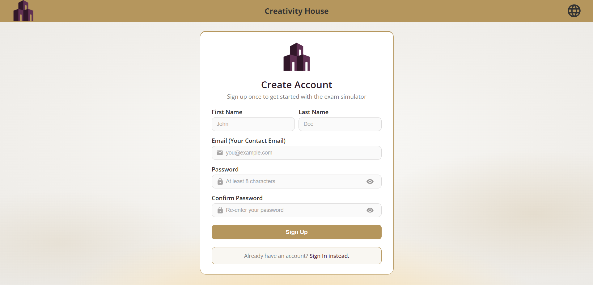
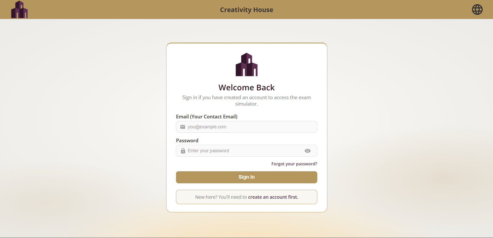
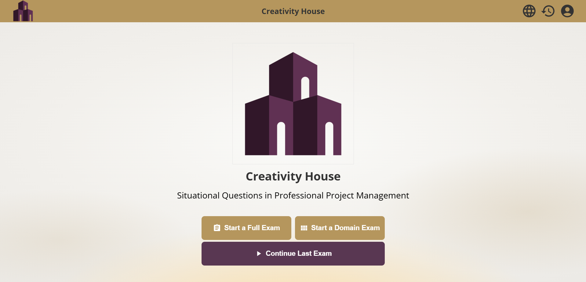
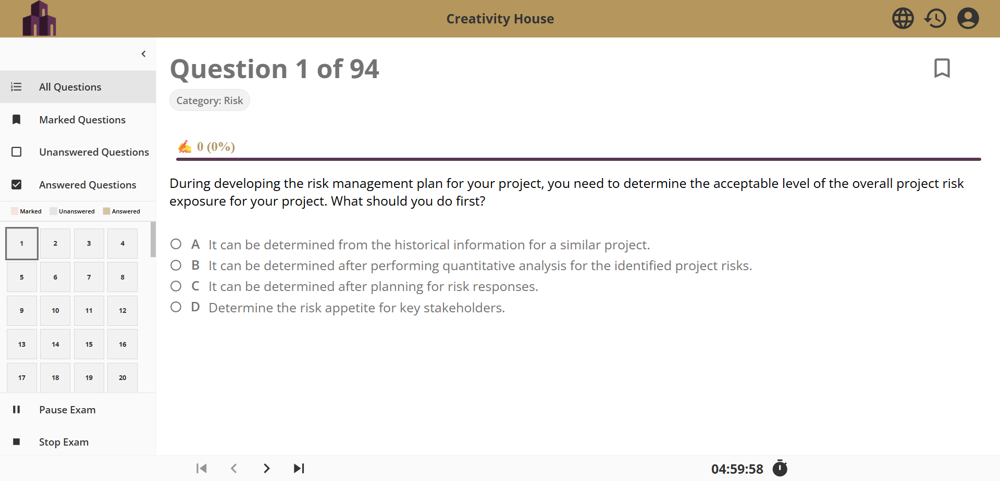
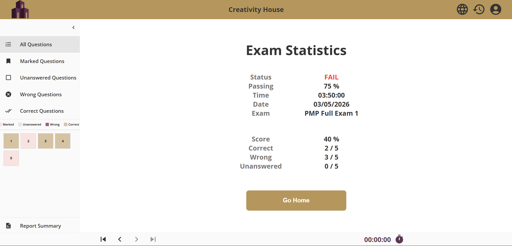
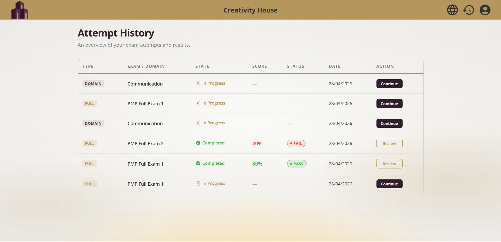
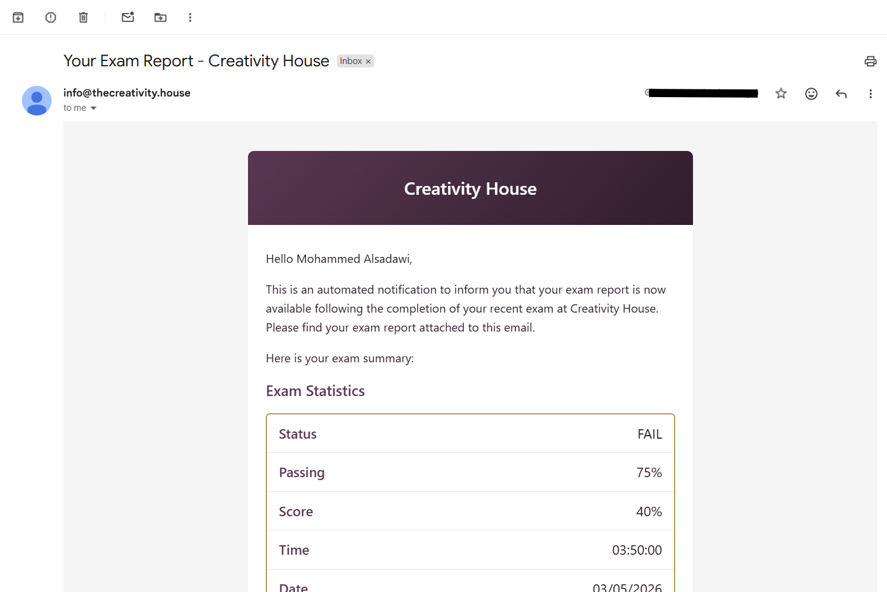

## Table of Contents

- [About](#about)
- [Features](#features)
  - [Account Management](#account-management)
  - [Exam Types](#exam-types)
  - [During the Exam](#during-the-exam)
  - [Results & Review](#results--review)
  - [Retry Wrong Answers](#retry-wrong-answers)
  - [Exam Attempt History](#exam-attempt-history)
  - [Email Report](#email-report)
  - [Language Support](#language-support)
- [Screenshots](#screenshots)
- [Tech Stack](#tech-stack)
- [Roadmap](#roadmap)

---

## About

A bilingual (Arabic/English) PMP exam simulator built for [Creativity House](https://creativity-house.com), a Malaysian company that prepares professionals for the PMP certification exam.

Web app (Private Users): https://exam-simulator-flax.vercel.app

---

## Current Version: v2.0

v2.0 introduced a full backend layer, user authentication, and subscription-gated access. The app moved from a frontend-only tool to a multi-user platform with accounts, access control, and persistent exam history.

---

## Features

### Account Management

- **Sign up** using a Creativity House offer email. Registration is gated — only users with an active subscription can create an account.
- **Sign in / Sign out** with email and password.
- **Forgot password** and **reset password** flows via email.
- **Single-device session enforcement** — each account can only be active on one device at a time. Signing in on a new device prompts the user to force sign out of the previous session.
- **Subscription expiry** — access is automatically revoked when a user's subscription period ends.

### Exam Types

- **Full Exam:** 180 questions, 230-minute countdown timer, selected from a predefined list.
- **Categorized Exam:** A shorter exam filtered by a PMP domain.

### During the Exam

- Question numbering and progress tracking (remaining and answered count).
- Pause the exam at any time.
- Submit early without completing all questions.
- Switch language (Arabic / English) at any time — question order and session state are preserved.

### Results & Review

- Score displayed as a percentage on completion.
- Full detailed review after submission showing: all answer choices, your selected answer, the correct answer, and the explanation for each question.

### Retry Wrong Answers

- A **Retry** option appears on the results screen.
- The retry session contains only the incorrect and unanswered questions, in their original order.
- Retry results are tracked separately and do not affect the original exam score.

### Exam Attempt History

- A dedicated **History page** shows the last 10 attempts for the signed-in user, including in-progress and completed sessions.
- Each row display the attempt details
- Clicking a completed attempt opens a full **Attempt Review page** showing the answers, correct choices, and explanations — read-only, no timer.
- Clicking an in-progress attempt resumes the exam.

### Email Report

- On exam completion, a report is automatically sent to the user's email.

### Language Support

- Full Arabic and English support throughout the simulator.
- Report and email language matches the language selected before exam completion.

---

## Screenshots

### Sign In / Sign Up

Authentication screens with subscription gating.

### Home / Exam Selection

Full and categorized exam type selection with dropdowns.

### Exam Session

Active exam with timer, progress bar, and question navigation.

### Results Summary

Score, pass/fail badge, and breakdown by correct/incorrect/unanswered.

### Attempt History

Table of past attempts with state and score at a glance.

### Email Report

HTML email report sent to the user's inbox.

---

## Tech Stack

| Layer | Technology |
|---|---|
| Frontend | React 19, TypeScript, Styled Components |
| State Management | React Context API (5 split contexts) |
| Backend | Vercel Serverless Functions (`/api`) |
| Database | Supabase (PostgreSQL) |
| Auth | Supabase Auth |
| CRM Integration | HighLevel (subscription verification) |
| Hosting | Vercel |

---

## Roadmap

| Phase | Description | Status |
|---|---|---|
| 1 | Predefined full exam selection dropdown | Complete |
| 2 | Backend infrastructure (Supabase database setup) | Complete |
| 3 | Authentication + HighLevel CRM integration | Complete |
| 4 | Single-device session enforcement | Complete |
| 5 | Persistent exam attempt history | Complete |
| 6 | Resume unfinished exams | Complete |
| 7 | Show correct answer during category exams | Pending |
| 8 | UI refresh (PMP-style interface) + rename category exam | Pending |
| 9 | Expand predefined full exam list | Pending |
| 10 | Break system (2 × 10-minute breaks at Q60 and Q120) | Pending |
| 11 | Full system testing and production deployment | Pending |

---

## References

Originally built from [Exam Simulator](https://github.com/exam-simulator/simulator) by [Benjamin Brooke](https://github.com/benjaminadk).